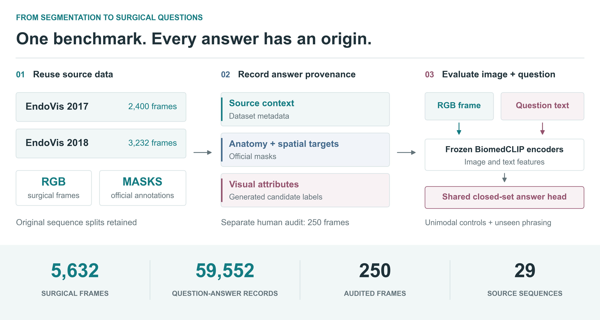

<div align="center">

# RoboSurg-VQA

### A Multimodal Visual Question Answering Benchmark<br>Derived from Surgical Segmentation Data

**Surgical images. Structured questions. Traceable answers.**

Chengyi Zhang &nbsp;&middot;&nbsp; Zi Ye &nbsp;&middot;&nbsp; Ziyang Wang<sup>*</sup>

<sub>* Corresponding author: <a href="mailto:z.wang47@aston.ac.uk">z.wang47@aston.ac.uk</a></sub>

[](#dataset)
[](docs/reproduction.md)
[](#quickstart)
[](LICENSE)

[Overview](#overview) &nbsp;|&nbsp; [Dataset](#dataset) &nbsp;|&nbsp; [Results](#reference-results) &nbsp;|&nbsp; [Quickstart](#quickstart) &nbsp;|&nbsp; [Documentation](#documentation) &nbsp;|&nbsp; [Citation](#citation)

</div>

<p align="center">
  
</p>

<p align="center"><sub>From source segmentation data to traceable question-answer records and shared-model evaluation. <a href="docs/assets/overview.svg">View the vector figure.</a></sub></p>

## Overview

Segmentation datasets contain more information about a surgical scene than
pixel labels alone express. RoboSurg-VQA makes those frames queryable through
closed-set questions about procedure context, anatomy, visibility and image
quality. It retains the origin of each answer and the original source-sequence
splits, bringing two EndoVis collections into a common evaluation format.

This repository accompanies the manuscript and contains the benchmark records,
human audit, reference implementations and frozen predictions.

- **A common question-answer interface.** Canonical questions, training
  paraphrases and held-out paraphrases cover the same closed answer sets.
  Original sequence identifiers and train/test assignments are retained.
- **Traceable annotations.** Source metadata, mask-derived targets and generated
  visual attributes have separate provenance. Two independent annotations and
  third-author adjudication are included for a 250-frame audit.
- **Question-conditioned evaluation.** A shared model with frozen BiomedCLIP
  encoders is evaluated alongside answer-frequency, question-only and
  image-only controls. Taskwise RGB and mask-geometry baselines provide
  complementary comparisons.

> **Start with the results, not a training run.** The frozen predictions and
> annotations are included. The [quickstart](#quickstart) checks the release
> and runs the tests without a GPU, source images or API calls.

## Dataset

| Source | Training frames | Test frames | Total |
| --- | ---: | ---: | ---: |
| EndoVis 2017 | 1,800 | 600 | 2,400 |
| EndoVis 2018 | 2,235 | 997 | 3,232 |
| **Total** | **4,035** | **1,597** | **5,632** |

The split contains 23 training and six test source sequences. The questions and
valid answers are defined in [configs/questions.json](configs/questions.json)
and [data/vqa_summary.json](data/vqa_summary.json).

| File | Purpose |
| --- | --- |
| [data/manifest.jsonl](data/manifest.jsonl) | Frame identifiers, source splits and image/mask paths |
| [data/vqa_records.jsonl](data/vqa_records.jsonl) | Questions, answers, paraphrases and sequence assignments |
| [data/frame_annotations.jsonl](data/frame_annotations.jsonl) | Frame-level labels and their provenance |
| [data/mask_targets.csv](data/mask_targets.csv) | Deterministic instrument-mask targets |
| [data/human_reference/](data/human_reference/) | Audit sample, individual annotations, adjudication and protocol |

The audit consists of a 200-frame representative sample and a separate
50-frame challenge sample. Human references are stored separately from the
benchmark labels and are used for evaluation, not model training.

Original RGB images and segmentation masks are obtained from the
[EndoVis 2017](https://endovissub2017-roboticinstrumentsegmentation.grand-challenge.org/Data/)
and [EndoVis 2018](https://endovissub2018-roboticscenesegmentation.grand-challenge.org/Data/)
providers. [Data preparation](docs/data_preparation.md) describes the retained
frames, array format and source-sequence conventions.

## Reference results

The shared image-question model reaches **0.540 mean Macro-F1**, compared with
0.391 for the answer-frequency baseline. It retains **0.528** when evaluated
with held-out paraphrases.

| Condition | Question wording | Mean Macro-F1 |
| --- | --- | ---: |
| Answer frequency | Canonical | 0.391 |
| Question only | Canonical | 0.255 |
| Image only | Canonical | 0.296 |
| **Image + question** | **Canonical** | **0.540** |
| Image + question | Held-out paraphrase | 0.528 |

These are unweighted means across the seven discriminative benchmark tasks,
evaluated against their benchmark labels with a fixed class list per task.
The neural conditions use the three-seed probability ensemble described in
[Reproduction](docs/reproduction.md#shared-question-conditioned-model).

See [aggregate results](results/shared_vqa/aggregate_metrics.csv),
[task-level results](results/shared_vqa/task_metrics.csv),
[paired bootstrap comparisons](results/shared_vqa/paired_bootstrap_deltas.csv)
and the separate [human-reference evaluation](results/shared_vqa_human_reference/).

## Quickstart

**Inspect and reproduce the statistics without a GPU, source images or API calls.**
Use Python 3.12 and run these commands in a virtual environment:

```bash
git clone https://github.com/chengyi-zhang/RoboSurg-VQA.git
cd RoboSurg-VQA
python -m pip install numpy==2.5.2
python scripts/validate_release.py
python -m unittest discover -s tests
```

The validator checks file hashes, record alignment and reported results. The
tests also check sequence separation, question variants and fixed-label
bootstrap metrics.

To recompute the shared model's human-reference evaluation in a new output folder:

```bash
python scripts/evaluate_shared_vqa.py --output outputs/shared_vqa_human_reference
```

For environment setup, the remaining analyses, feature extraction and training,
follow [Reproduction](docs/reproduction.md). Dataset preparation is needed for
feature extraction, but not for the statistical analyses.

## Documentation

| Guide | What you will find |
| --- | --- |
| [Data preparation](docs/data_preparation.md) | Official downloads, retained frames, array layout and source splits |
| [Reproduction](docs/reproduction.md) | Statistical analyses, feature extraction, training and pinned checkpoints |
| [Question definitions](configs/questions.json) | Canonical questions, training paraphrases and held-out wording |
| [Human audit](data/human_reference/) | Sample manifest, independent annotations, adjudication and protocol |
| [Automated checks](.github/workflows/validate.yml) | File integrity, record consistency and metric regression tests |

### Repository layout

```text
configs/     Question definitions, prompts and model settings
data/        Benchmark records and human-reference annotations
docs/        Data preparation, reproduction and overview figure
results/     Frozen predictions and numerical results
scripts/     Dataset assembly, training and evaluation
tests/       Metric and data-integrity regression tests
```

Large source media, pretrained weights, feature caches and training outputs are
not stored in the repository. Weight downloads use the official providers and
are cached under `.cache/`; model and tokenizer revisions are pinned in
[configs/shared_vqa.json](configs/shared_vqa.json).

## Citation

**Chengyi Zhang, Zi Ye and Ziyang Wang.**
*RoboSurg-VQA: A Multimodal Visual Question Answering Benchmark Derived from
Surgical Segmentation Data.*

Publication details and BibTeX will be added here when the paper is published.

## Licence

The source code is available under the [MIT License](LICENSE). EndoVis media,
source annotations, pretrained weights and third-party software retain their
respective licences. Original surgical images and masks are not redistributed.

For questions or reproducibility issues, please
[open an issue](https://github.com/chengyi-zhang/RoboSurg-VQA/issues).
